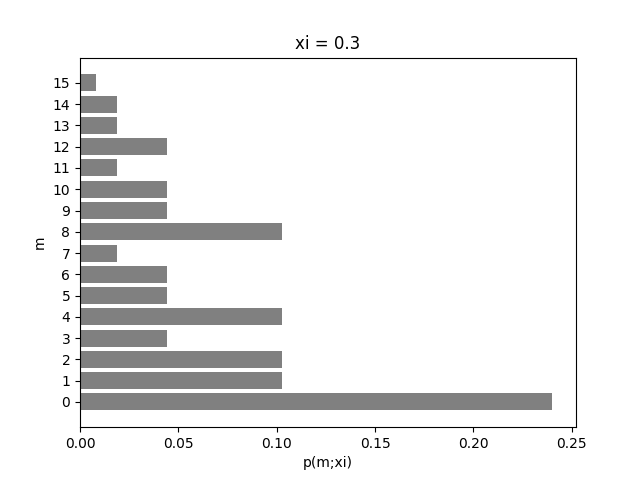
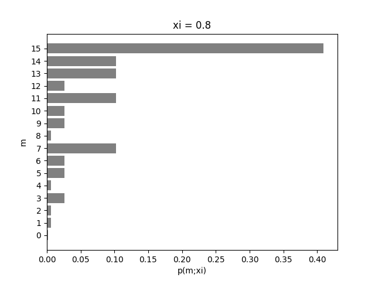
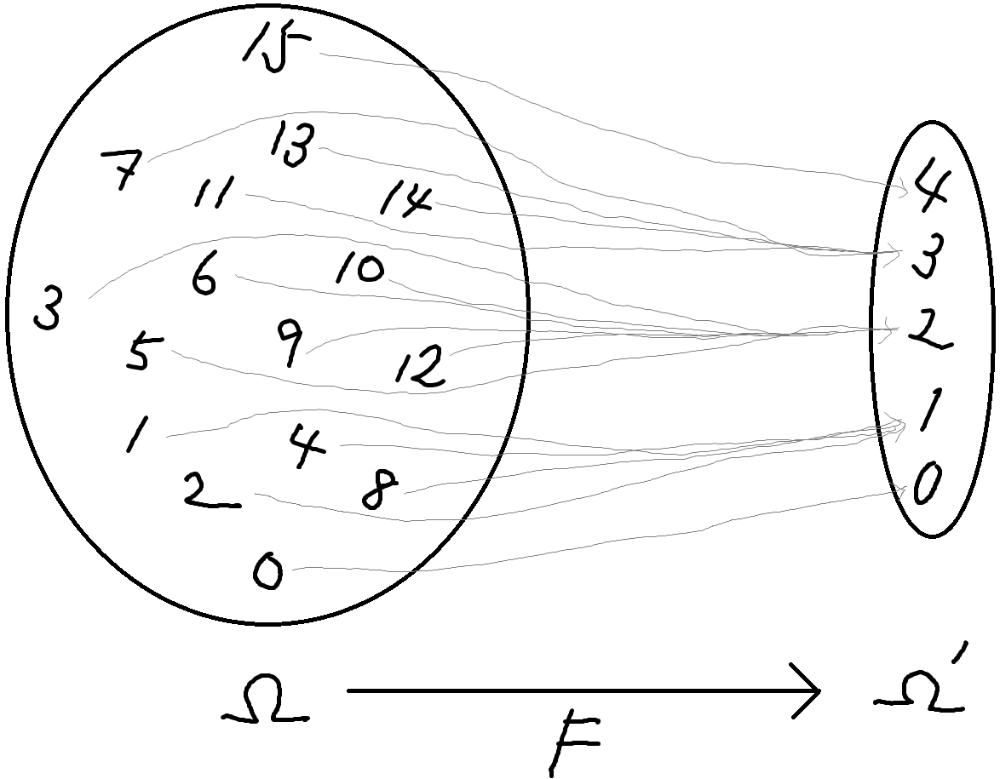
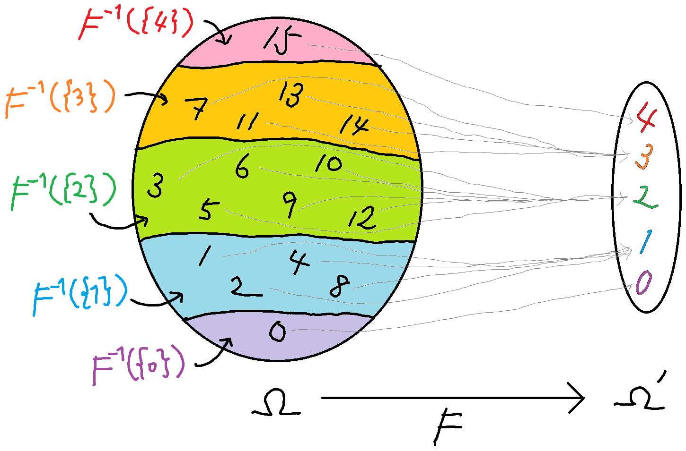
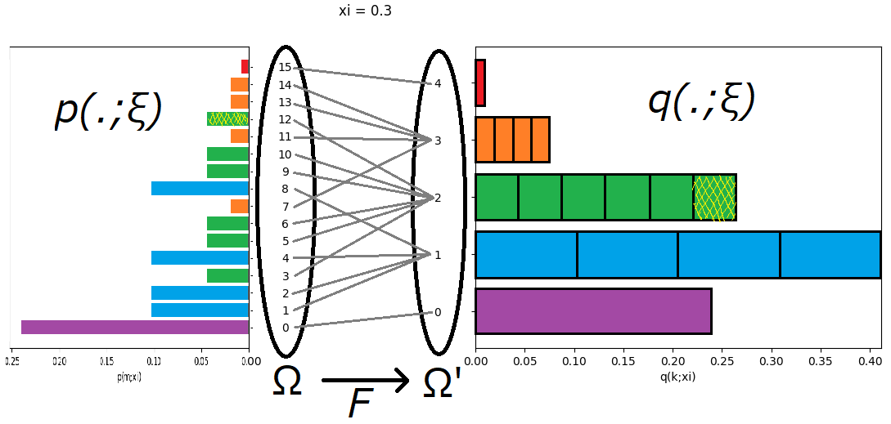
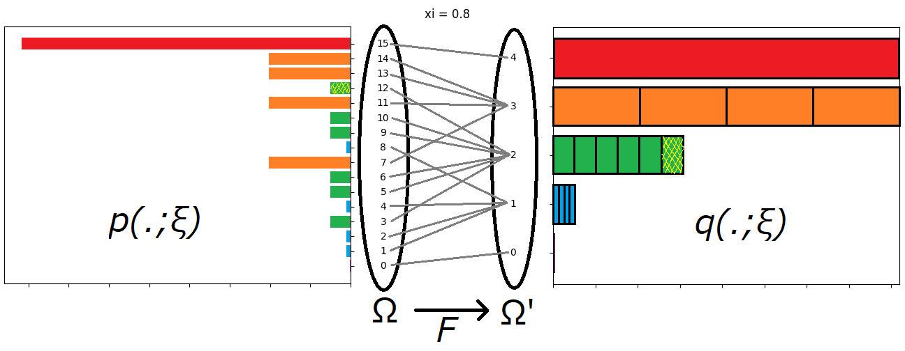
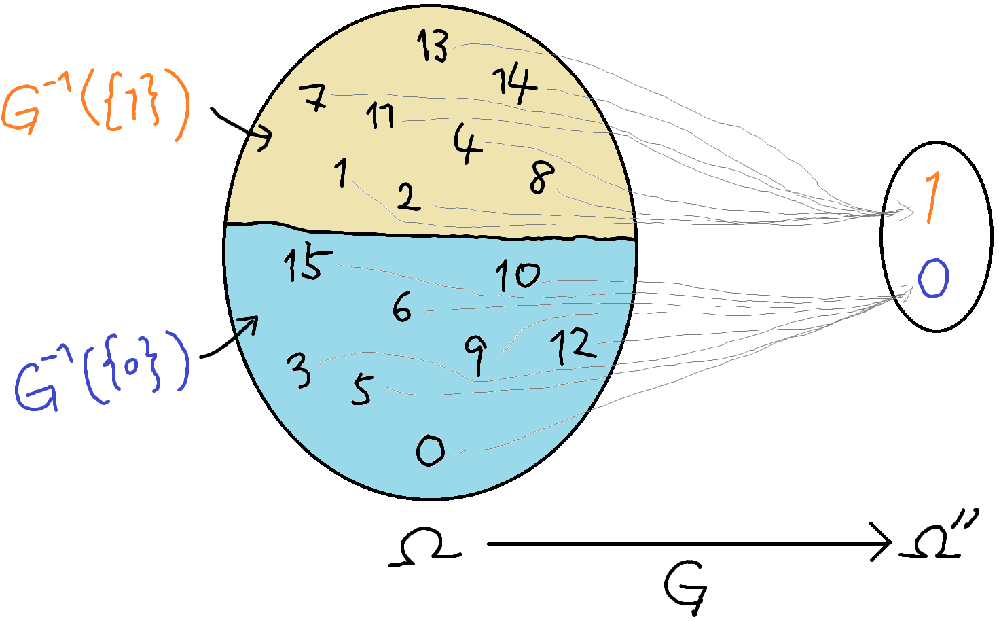
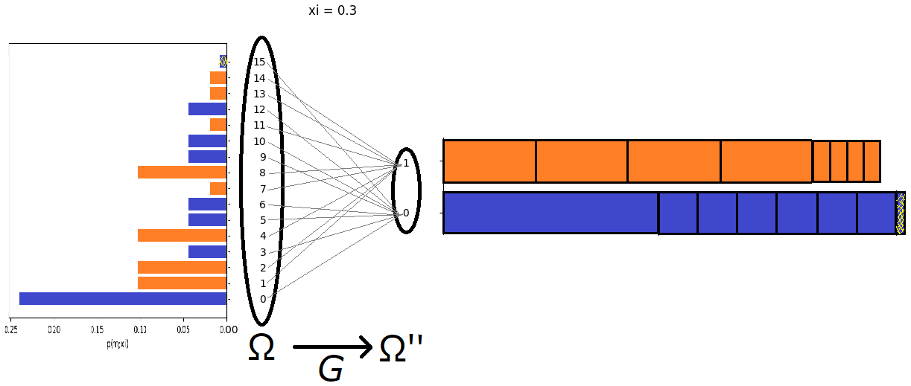
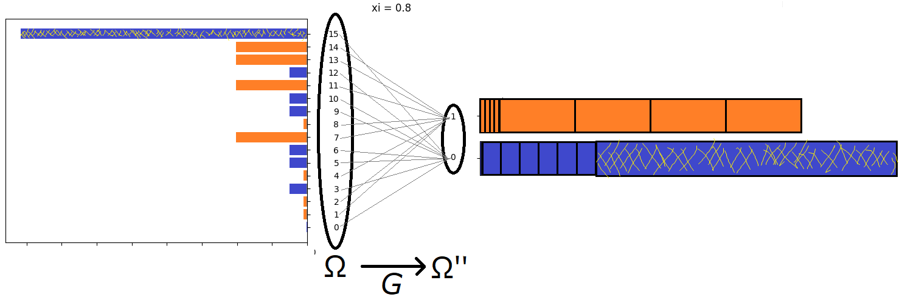

# 例 1.16 を通じて十分統計量の気持ちを理解したい
## 概要
本稿では例 1.16 を通じて十分統計量の気持ちを理解することを試みる．結論を先に言うと，理解できなかった．というのも，「十分」という言葉は何やら「パラメータの推定」に関わっているらしいが，パラメータの推定に関する話はこれまでに出てきてないからである．しかしながら，色々と絵を描いてみることで，**「十分統計量とは標本空間上のうまい同一視のことである」** という洞察が得られた．本稿ではそのことを書く．

以下，例として $n=4$ で考える．

## 例 1.14 の確率モデル $S$
- 「大きいほう」の標本空間 $\Omega$
  - $\Omega:=\{0,1,2,3,\ldots,14,15\}$
- パラメータ $\xi$
  - $\xi\in(0,1)\subseteq\mathbb{R}^1$
  - $\xi$ は $1$ 回のコイントスで表が出る確率．←この $\xi$ を推定したいらしい
- 確率関数 $p(\cdot;\xi)$
  - $m\in\Omega$ に対し，$p(m;\xi) = \xi^k(1-k)^{4-k}$
    - $k$ は $m$ を二進法で表記したときの $1$ の個数．
  - 例： $\xi=0.3$
  
    

  - 例： $\xi=0.8$

    
- 確率モデル $S$
  - $S:=\{p(\cdot;\xi)\mid\xi\in(0,1)\}$
    - パラメータ $\xi\in(0,1)$ でパラメータ付けられた確率関数の集合．
    - $\xi\in(0,1)$ を動かしたときの上のような棒グラフ全体が成す集合 $S$ だと思ってよい．

## 小さい標本空間への対応付け
- 「小さいほう」の標本空間
  - $\Omega':=\{0,1,2,3,4\}$
- 「大きい標本空間」から「小さい標本空間」への対応 $F\colon\Omega\to\Omega'$ は次で定義：
  - $F(m):= m を二進法で表記したときの 1 の個数．$
  - 明らかに全射．

    

## 確率モデル $S_F$ の構成
- $\Omega'$ 上の確率関数 $q(\cdot;\xi)$ は次式で定義されるのであった：
  $$
  q(k;\xi):=\sum_{m\in F^{-1}(\{k\})}p(m;\xi)\quad(k\in\Omega')
  $$
  - $F^{-1}(\{k\})=\{m\in\Omega\mid F(m)=k\}=\{m\in\Omega\mid m を二進法で表すと 1 が k 個\}$

    

  - したがって，$m\in F^{-1}(\{k\})$ ならば $m$ を二進法で表したときの $1$ の個数は $k$ 個なので，$p$ の定義より $p(m;\xi)=\xi^k(1-k)^{4-k}$
  - $F^{-1}(\{k\})$ の要素数は，$4$ ビット中 $k$ ビットが $1$ であるような二進数の個数なので，${}_4\mathrm{C}_k$
  - よって以下が成り立つ．これは二項分布 (例 1.13) に他ならない．
  $$
  q(k;\xi)={}_4\mathrm{C}_k\xi^k(1-k)^{4-k}
  $$
  - 以上の議論を絵にまとめると次の通り：
    -  $\xi=0.3$ 
    
        

    -  $\xi=0.8$ 
    
        

## $r(\cdot;\xi)$ の計算
- $r(\cdot;\xi)$ は次のように定義されるのであった：
  - $r(m;\xi):=\frac{p(m;\xi)}{q(F(m);\xi)}\quad(m\in\Omega)$
- 例として $m=12$ を取り上げる．
  - $\xi=0.3$ の絵に着目しよう．$r(12;0.3)=\frac{p(12;0.3)}{q(F(12);0.3)}=\frac{p(12;0.3)}{q(2;0.3)}=\frac{1}{6}$ がわかる．
  - $\xi=0.8$ の絵に着目しよう．$r(12;0.8)=\frac{p(12;0.8)}{q(F(12);0.8)}=\frac{p(12;0.8)}{q(2;0.8)}=\frac{1}{6}$ がわかる．
- このようにして $r(m;\xi)$ を計算していくと，$r(m;\xi)$ は $\xi$ に依存しないことがわかる．
  - $r(m;\xi)$ は $\xi$ が関わらない「箱の数」のみに依存し，$\xi$ が関わってくる「箱の長さ」には依存しない！
- したがって $F$ は $S$ に関する十分統計量である．

## 「十分統計量」の気持ちを理解したい
### 十分統計量とはうまい同一視のことである
- $S$ は，$4$ 回のコイン投げに関する全ての情報を完全に持っている統計モデル．
- $S_F$ は，$4$ 回コインを投げて，何回表が出たかの情報のみを持っている統計モデル．
- $F$ は，$S$ のような粒度の細かい統計モデルから $S_F$ のような粒度の粗い統計モデルへの変換を惹き起こす．
- $F$ が「同一視」を行うことで粒度を粗くしている．
  - $\{3=1100_2,5=1010_2,6=0110_2,9=1001_2,10=0101_2,12=0011_2\}$ は $S$ では区別される．
  - $F$ が惹き起こす同一視（「$1$ の個数が同じものは同一視」）を通すことで，$S_F$ においてはこれら $6$ つは同一視される．
- 余談：「全射」と「同一視」は切っても切れない関係にある．つまり，全射があれば同一視が誘導され，同一視があれば全射が誘導される．
  - $G\colon\Omega\to\Omega'$ が全射なら，$\Omega$ 上の同値関係 $\sim$ を 「$\omega_1\sim\omega_2\Leftrightarrow G(\omega_1)=G(\omega_2)$」で入れることができ，それによって $\Omega=\bigsqcup_{\omega'\in\Omega'}G^{-1}(\{\omega'\})$ と $\Omega$ を 直和分解できる．
  - 逆に，$\sim$ が $\Omega$ 上の同値関係なら $\Omega':=\Omega/{\sim}$ とし，標準全射 $G\colon\Omega\ni\omega\mapsto[\omega]\in\Omega'$ が得られる．
- どんな全射（同一視） $\Omega\to\Omega'$ も十分統計量になれるわけではない．**十分統計量とは，うまい同一視のこと**といえる．「うまさ」の尺度が，「$r(\cdot;\bm{\xi})$ が $\bm{\xi}$ によらない」である．

### $r(\cdot;\bm{\xi})$ とはなんなのか
- $r(\cdot;\bm{\xi})$ の分母は同一視されるものたちの確率の和，分子はそのうちの $1$ つとなっているので，$r(\cdot;\bm{\xi})$ はある種の貢献度とみなせる．
  - 例：$r(12;\xi)=\frac{p(12;\xi)}{p(3;\xi)+p(5;\xi)+p(6;\xi)+p(9;\xi)+p(10;\xi)+p(12;\xi)}=\frac{そのうちの1つ}{同一視されるものたちの確率の和}$
- $r(\cdot;\bm{\xi})$ が $\bm{\xi}$ に依らない，というのは，この貢献度がある種の均質性や不変性のようなものを持っているとか，貢献度は同一視の構造だけに依存する，のようなふわっとした理解ができる．しかし今のところ私はこれを上手く説明する言葉を持っていない．

### 「十分統計量」の気持ち
- まずは著者の言葉に耳を傾ける．
  - *あたえられた統計的モデル $S$ の元であることがわかっている確率関数のパラメータ $\bm{\xi}$ がどのような値であるかを推定するには，十分統計量 $F$ を用いて，対応する $S_F$ の元となる確率関数のパラメータ $\bm{\xi}$ の値を推定すれば十分である．これが十分統計量という言葉の意味である．* (p.26)
- どうも，「パラメータの推定」に関わっているらしい．しかし今のところパラメータの推定の話は出ていないので，上の説明だけで「十分」という言葉の気持ちを完全に理解することはできない．
- しかし次の文は，「十分」の気持ちを掴ませてくれるような気がする．
  - *あるコインの表が出る確率 $\xi$ を知りたいとしよう．ただし $0<\xi<1$ とする．$\xi$ の値を推定するには，コインを何回か投げた時に，いつ表が出たのかまでを調べずとも，何回表が出たのかを調べればよさそうである．* (p.27)

### 反例を作る
- あるコインの表が出る確率 $\xi$ を知りたいとする．コインを何回か投げた時に「表が出た回数の偶奇」を調べても $\xi$ の値を推定することはできなさそうである．つまり，「表が出た回数の偶奇」は「十分な統計量」だといえなさそうである．
- そこで，次のような標本空間 $\Omega''$ と全射 $G\colon\Omega\to\Omega''$ を考え，$G$ が十分統計量でないことを示す．
  - $\Omega'':=\{0,1\}$
  - $G(m):=m を二進法で表記したときの 1 の個数が偶数なら0, 奇数なら 1$
    
    

  - $r(15;0.3)$ は下図右側の青棒全体に占める黄色ハッチ部の割合である．「$p(15;0.3)$ の貢献度がかなり小さい」と読める．
    
    

  - $r(15;0.8)$ は下図右側の青棒全体に占める黄色ハッチ部の割合である．「$p(15;0.8)$ の貢献度がかなり大きい」と読める．
      
    

  - よって明らかに $r(15;0.3)\neq r(15;0.8)$ である．つまり $r$ が $\xi$ に依存している．
  - **よって，$G$ は $S$ に関する十分統計量ではない．**
    - 先の言葉を使えば，「$1$ の個数の偶奇が同じ」という「同一視」は，「うまくない同一視」である．
    - まだ上手く説明する言葉を持っていないが，「貢献度がある種の均質性や不変性のようなものを持っていない」とか，「貢献度が同一視の構造のみならずパラメータ $\xi$ にも依存している」状況である．